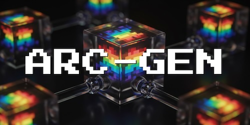

<p align="center">

</p>

# ARC-GEN: Procedural Benchmark Generation & Overfitting Validation

This repository contains the source code for **ARC-GEN**, a mimetic procedural benchmark generator for the Abstraction and Reasoning Corpus (ARC).

ARC-GEN serves two primary roles:
1. **Synthetic Data Generation**: Creating thousands of procedurally generated ARC-style input/output pairs for training and evaluation.
2. **Strict Overfitting Validation**: A robust testing suite for the [2026 NeuroGolf Championship](https://www.kaggle.com/competitions/neurogolf-2026), designed to identify "lookup-based" or overfitted models by testing them against fresh, unseen task variations.

For a deep dive into the underlying methodology, see the [ARC-GEN paper on arXiv](https://arxiv.org/abs/2511.00162).

---

## 🛠 Main Use Cases

### 1. Generating Synthetic ARC Pairs
ARC-GEN can generate a near-infinite variety of examples for each supported task. This is useful for training generalized solvers that don't rely on hardcoded memorization.

**Command:**
```bash
# Generate 1000 pairs for a specific task hex ID
python3 arc_gen.py generate 1e0a9b12 1000
```

### 2. NeuroGolf Overfitting Validator
In the NeuroGolf competition, models are represented as ONNX files. Many high-scoring models are actually "lookups" that memorized the training pairs but fail on slightly different inputs. `gen_fresh_pairs.py` identifies these by generating "fresh" variations (different colors, shapes, or positions) that follow the same logic.

**Command:**
```bash
# Test an entire submission directory against 50 fresh pairs per task
python gen_fresh_pairs.py --onnx-dir ../submission --n 50
```

**Key Features:**
- **Automated Mapping**: Automatically maps NeuroGolf task numbers (task000...task399) to ARC-GEN procedural generators.
- **Unseen Inputs**: Ensures that generated inputs have never appeared in the original training or test sets.
- **Overfitting Report**: Flags models with a pass rate below 50% as `← OVERFITTED?`.

---

## 🚀 Getting Started

### Installation
```bash
git clone --recurse-submodules https://github.com/Ashok-19/ARC-GEN-validator.git
cd ARC-GEN-validator
```

### Advanced Usage

**Filter specific tasks:**
```bash
python gen_fresh_pairs.py --tasks 18 66 76 --n 100
```

**Save fresh pairs to JSON for local debugging:**
```bash
python gen_fresh_pairs.py --tasks 18 --n 50 --save-json
```

---

## 📊 The ARC-GEN-100K Dataset
We provide a pre-generated dataset of 100,000 example pairs covering all 400 tasks, available here:
[The ARC-GEN-100K Dataset on Kaggle](https://www.kaggle.com/datasets/arcgen100k/the-arc-gen-100k-dataset)

<p align="center">

</p>

---

## 📝 Citation
```bibtex
@misc{Moffitt2025,
  title={{ARC-GEN: A Mimetic Procedural Benchmark Generator for the Abstraction and Reasoning Corpus}}, 
  author={Michael D. Moffitt},
  year={2025},
  eprint={2511.00162},
  archivePrefix={arXiv},
  primaryClass={cs.AI},
  url={https://arxiv.org/abs/2511.00162}, 
}
```
